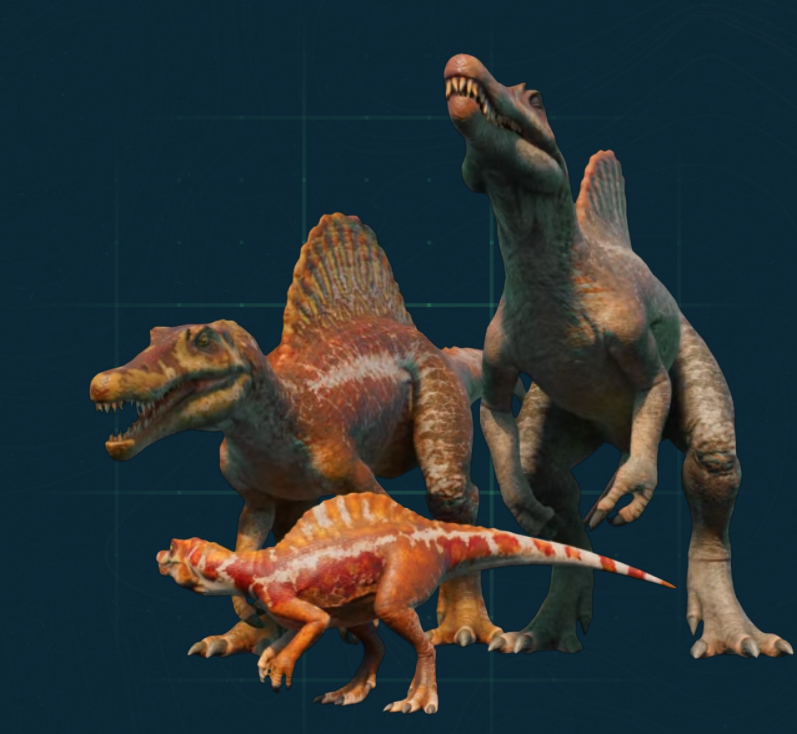

# Unit-5-Personal-Narrative-Project-
Unit 5 Personal Narrative Project # Unit 5 - Personal Narrative / Interest Animation

## Introduction

Images are often used to portray our personal experiences and interests. We also use image filters and effects to change or enhance the mood of an image. When combined into collages and presentations, these images tell a story about who we are and what is important to us. Your goal is to create an animation using The Theater and Scene API that consists of images of your personal experiences and/or interests. In this animation, you will incorporate data related to these experiences and/or interests that can be organized in a 2D array, and use image filters and effects to change or enhance the mood of your images.
## Requirements

Use your knowledge of object-oriented programming, two-dimensional (2D) arrays, and algorithms to create your personal narrative collage or animation:
- **Write Scene subclasses** – Create two Scene subclasses: either two core parts of your personal life, or two components of a personal interest. Each class must contain a constructor and private instance variable with data related to the scene
- **Create at least two 2D arrays** – Create at least two 2D arrays to store the data that will make up your visualization.
Implement algorithms – Implement one or more algorithms that use loops and logic that operate on the data in your 2D arrays.
- **Create a visualization** – Create an animation that conveys the story of the data by illustrating the patterns or relationships in the data.
- **Image Filters** – Utilize the image filters created in this unit (and possible new filters) that show a personal flare to the images used in your animation.
- **Document your code** – Use comments to explain the purpose of the methods and code segments and note any preconditions and postconditions.

## UML Diagram

Put an image of your UML Diagram here. Upload the image of your UML Diagram to your repository, then use the Markdown syntax to insert your image here. Make sure your image file name is one work, otherwise it might not properly get displayed on this README.

## Video

Record a short video of your story to display here on your README. You can do this by:

- Screen record your project running on Code.org.
- Upload that recording to YouTube.
- Take a thumbnail for your image.
- Upload the thumbnail image to your repo.
- Use the following markdown

Thumbnail for my project

https://youtu.be/at4g5zJg8M8

## Story Description

Write a description of the story that your animation showcases. Give additional context for your story here in the case your animation is more abstract and only has images and little text. Lastly, include what data in your project is represented in 2D arrays and how those directly relate to the story your animation showcases.

My animation showcases 4 different filters and 8 of my favorite non herbivorous dinosaurs from the game Jurassic World Evolution 3. JWE3 is a a game where you build your own Jurassic World, with about 90 species from the past (dinosaurs, pterosaurs, and prehistoric ocean animals). 
The game is based on the Jurassic Franchise and has species from either the films, the novels, and species that weren't in either.
There's also the campaign mode and the challenge modes, which have tasks and have prizes. I included these 8 dinosaurs since they're all very nice to have in my park and building enclosures for them is very fun. Each picture has the mother (right), the father (left), and the juvenile (center) variants of the dinosaurs. If there's only one dinosaur in the picture, that means it's a hybrid, which can't breed.

## Image Filter Analysis

Choose at least 2 filters used in your animation to explain how the pixels are modified. If you created a new image filter that was not one of the ones from this unit, make sure to explain and analyze that filter(s) before choosing ones that came from this unit.

My custom made filter is the darkening filter (applied on the last pictures in the video). The pixels in this are modified by subtracting a value (chosen by the user) from the RGB values in unedited photo. For example, if a photo had the values R = 250, G = 190, B = 140, and the user chose the value 50, the new values would be:
R = 200
G = 140
B = 90
Overall, the colors just become less intense and make the whole photo darker uniformly. 

Another filter I used was the colorshift filter. In this filter, the user chooses a value, and it's added to the RGB values in the photo (very similar logic to the darken filter mentioned above). The new value will give a brighter contrast (positive value) or a lower contrast (negative value) when compared to the old photo. Additionally, if any of the new RGB values go below 0, they're set equal to 0, as well as being set to 255 if they new numbers are greater than 255, working as a failsafe. 
